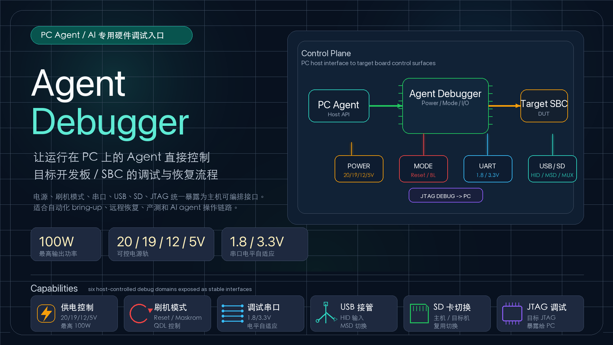

# agent-debugboard

[English](README.md)

`agent-debugboard` 是 **Agent DebugBoard** 的 RP2040 固件。它把一块硬件
调试板变成 PC 侧 Agent/AI 可以直接操作的 USB 控制接口，用于控制目标开发板
或 SBC 的供电、刷机模式、TF/SD 路由、电流监测 ADC 和一组安全 GPIO。



## 项目简介

Agent DebugBoard 面向自动化 bring-up、远程恢复、产测和 AI agent 调试链路。
固件会枚举为名为 `Agent DebugBoard` 的 USB CDC ACM 串口设备，并提供
`debugboard` shell 命令；仓库里同时提供了主机侧 Go native CLI，方便脚本或
Agent 直接调用。

本仓库包含 Zephyr 应用、主机侧辅助工具、单元测试、原理图副本和项目文档。

## 功能范围

| 模块 | 当前固件支持 |
| --- | --- |
| USB 控制 | CDC ACM shell，提供 `debugboard` 命令 |
| 主机自动化 | 支持 JSON 输出和 `doctor` 诊断的 `agent-debugboardctl` CLI |
| 电源轨 | `12v_out`、`5v_out`、`5v_ws`、`20v_out` |
| ADC 监测 | 读取 `5v_out`、`12v_out`、`20v_out` 的电流监测通道 |
| TF/SD 路由 | 在 `target` 和 `usb-reader` 之间切换 |
| GPIO | 安全白名单：`GP13`、`GP14`、`GP15`、`GP22`、`GP23`、`GP24` |
| 固件更新 | 通过 USB 命令让 RP2040 进入 BOOTSEL |

`5V_FIN` 会被当作独立的输入/来源电源轨处理，不作为可控输出电源轨暴露给主机。

## 给 AI Agent 的使用入口

AI Agent 在操作硬件前，应先读取
[skills/agent-debugboard/SKILL.md](skills/agent-debugboard/SKILL.md)。这份 skill
是仓库内面向 Agent 的权威操作规程，包含 `agent-debugboardctl` 的安装、连接诊
断、JSON 命令使用和有副作用操作的安全规则。

推荐 Agent 最小流程：

```sh
agent-debugboardctl --version
agent-debugboardctl --json doctor
agent-debugboardctl --json status
```

如果 `agent-debugboardctl` 未安装，先按 skill 中的安装命令处理。自动化场景
优先使用 `agent-debugboardctl --json ...`，解析 `schema`、`ok`、`command` 和
`error.code`，不要解析面向人看的文本输出。

## 安装主机侧 CLI

`agent-debugboardctl` 是 Go native binary。用户不需要 Python、pip 或虚拟环境。

在 checkout 内，macOS / Linux 可以把 host CLI 安装到 skill-local
`scripts/bin` 目录：

```sh
./skills/agent-debugboard/scripts/install.sh
```

也可以指定 release 版本：

```sh
./skills/agent-debugboard/scripts/install.sh --version <tag>
```

私有仓库 release fallback 需要先提供 GitHub token。已经登录 GitHub CLI 的机器
可以直接使用 `gh auth token`：

```sh
export GH_TOKEN="$(gh auth token)"
./skills/agent-debugboard/scripts/install.sh
```

Windows PowerShell：

```powershell
powershell.exe -NoLogo -NoProfile -NonInteractive -ExecutionPolicy Bypass -File .\skills\agent-debugboard\scripts\install.ps1
```

私有仓库 PowerShell release fallback：

```powershell
$env:GH_TOKEN = gh auth token
powershell.exe -NoLogo -NoProfile -NonInteractive -ExecutionPolicy Bypass -File .\skills\agent-debugboard\scripts\install.ps1
```

也可以从 GitHub Release 手动下载匹配 OS 和 CPU 的产物：

| 系统 / CPU | 产物 |
| --- | --- |
| Windows x64 | `agent-debugboardctl_windows_amd64.zip` |
| Windows arm64 | `agent-debugboardctl_windows_arm64.zip` |
| Linux x64 | `agent-debugboardctl_linux_amd64.tar.gz` |
| Linux arm64 | `agent-debugboardctl_linux_arm64.tar.gz` |
| macOS Intel | `agent-debugboardctl_darwin_amd64.tar.gz` |
| macOS Apple Silicon | `agent-debugboardctl_darwin_arm64.tar.gz` |

macOS 上未签名的 release 二进制可能触发 Gatekeeper，提示 Apple 无法验证软件。
安装脚本会先校验 `SHA256SUMS.txt`，再移除安装后二进制的 quarantine 标记。
如果手动安装，请先校验 SHA256，再执行：

```sh
xattr -dr com.apple.quarantine ./agent-debugboardctl
```

安装后验证：

```sh
./skills/agent-debugboard/scripts/bin/agent-debugboardctl --help
./skills/agent-debugboard/scripts/bin/agent-debugboardctl --version
./skills/agent-debugboard/scripts/bin/agent-debugboardctl doctor
```

## 构建固件

创建 Python 环境并拉取 Zephyr：

```sh
python3 -m venv .venv
source .venv/bin/activate
pip install -U pip west

west init -l .
west update
west zephyr-export
pip install -r zephyr/scripts/requirements.txt
```

如果还没有安装 Zephyr SDK，需要先安装。当前本地构建已用 Zephyr SDK
`1.0.1` 验证过。

构建 RP2040 固件：

```sh
source .venv/bin/activate
west build -p always -b rpi_pico/rp2040 apps/agent_debugboard -d build/agent_debugboard
```

生成的 UF2 文件位置：

```text
build/agent_debugboard/zephyr/zephyr.uf2
```

## 刷写

如果板子当前已经运行本固件，可以先让它进入 BOOTSEL，再刷写新的 UF2：

```sh
agent-debugboardctl bootloader
picotool load -v -x build/agent_debugboard/zephyr/zephyr.uf2
```

如果板子已经以 `RPI-RP2` 磁盘方式挂载，只需要执行：

```sh
picotool load -v -x build/agent_debugboard/zephyr/zephyr.uf2
```

## GitHub Actions 产物

`Build` workflow 会检查每次 push 和 pull request。推送 `v*` tag 会触发
`Release` workflow，自动构建固件、打包主机 CLI、创建 GitHub Release，并上传
固定命名的 release assets。

- `agent-debugboard-rp2040.uf2`：用于拖拽刷写或 `picotool` 的 RP2040 固件。
- `agent-debugboard-rp2040.elf`：用于调试的 RP2040 ELF。
- `agent-debugboard-rp2040.map`：RP2040 链接 map。
- `agent-debugboardctl_windows_amd64.zip`：Windows x64 native CLI。
- `agent-debugboardctl_windows_arm64.zip`：Windows arm64 native CLI。
- `agent-debugboardctl_linux_amd64.tar.gz`：Linux x64 native CLI。
- `agent-debugboardctl_linux_arm64.tar.gz`：Linux arm64 native CLI。
- `agent-debugboardctl_darwin_amd64.tar.gz`：macOS Intel native CLI。
- `agent-debugboardctl_darwin_arm64.tar.gz`：macOS Apple Silicon native CLI。
- `SHA256SUMS.txt`：所有 release assets 的 SHA256 校验文件。

开发者可以从源码构建 host CLI：

```sh
go build -o agent-debugboardctl ./cmd/agent-debugboardctl
./agent-debugboardctl --help
```

## 主机侧使用

查询调试板状态：

```sh
agent-debugboardctl status
agent-debugboardctl doctor
```

Agent 或自动化程序推荐优先使用 JSON 输出。JSON 响应固定包含
`schema: "agent-debugboard.v1"`、`ok`、`command`，成功时返回命令相关字段，
失败时返回 `error: {code, message}`：

```sh
agent-debugboardctl --json doctor
agent-debugboardctl --json status
agent-debugboardctl --json rail list
agent-debugboardctl --json adc read
agent-debugboardctl --json gpio list
```

控制电源轨：

```sh
agent-debugboardctl rail set 12v_out on
agent-debugboardctl rail set 12v_out off
agent-debugboardctl rail set 5v_out on
agent-debugboardctl rail set 5v_out off
agent-debugboardctl rail set 5v_ws on
agent-debugboardctl rail set 20v_out on
```

读取电流监测 ADC 通道：

```sh
agent-debugboardctl adc read
agent-debugboardctl adc read 5v_out
agent-debugboardctl adc read -v 5v_out
agent-debugboardctl adc read 12v_out
agent-debugboardctl adc read 20v_out
```

人类可读 ADC 输出默认保持简洁，例如 `5v_out=540mA`。需要调试字段时使用
`-v` / `--verbose`，会额外输出 `signal`、`raw`、`mv` 等信息。JSON 输出仍保留完整结构化数据。

切换 TF/SD 路由：

```sh
agent-debugboardctl sd route target
agent-debugboardctl sd route usb-reader
```

使用安全 GPIO：

```sh
agent-debugboardctl gpio list
agent-debugboardctl gpio set GP13 1
agent-debugboardctl gpio input GP13
```

## OpenOCD / JTAG

Agent DebugBoard 可以和 OpenOCD 配合使用：DebugBoard 负责目标板供电和恢复
控制，板载 CH347F 路径负责目标板 JTAG/SWD。CH347F 直连目标调试口，RP2040
不在 JTAG/SWD 数据链路中，也不会把 DebugBoard 自己模拟成 CMSIS-DAP 或 JTAG
probe。

安装 OpenOCD 后先确认版本：

```sh
openocd --version
```

先给目标板供电，然后使用本机 OpenOCD 安装里的 CH347F interface 配置和目标板
对应的 target 配置启动 OpenOCD：

```sh
agent-debugboardctl --json rail set 5v_out on
openocd -f interface/<ch347-interface>.cfg -f target/<target>.cfg
```

CH347F 支持取决于 OpenOCD 构建版本。如果系统包没有 CH347F interface script，
需要使用 WCH/vendor OpenOCD 构建，或补充匹配的 interface 配置。

OpenOCD 通常会在 TCP `3333` 暴露 GDB server，并在 TCP `4444` 暴露 telnet
控制接口。目标板重启优先使用 OpenOCD 的 `reset halt`、`reset run` 或目标系统
自己的软重启；只有软重启不可行时，才使用电源轨断电再上电作为硬重启 fallback。

完整流程见 [doc/openocd/README.md](doc/openocd/README.md)。

## 直接使用 Shell

打开 CDC 串口设备后，可以直接使用 `debugboard` 命令：

```text
debugboard status
debugboard status --json
debugboard rail list
debugboard rail list --json
debugboard adc read
debugboard adc read -v 5v_out
debugboard adc read --json
debugboard sd get
debugboard sd get --json
debugboard gpio list
debugboard gpio list --json
debugboard bootloader
```

## 硬件映射

| 功能 | 固件名称 | 原理图信号 |
| --- | --- | --- |
| 12 V 输出使能 | `12v_out` | `GP02_12V_EN` |
| 5 V 输出使能 | `5v_out` | `GP05_5V_EN` |
| 5 V WS 使能 | `5v_ws` | `GP09_5V_WS_EN` |
| 20 V 输出使能 | `20v_out` | `GP10_20V_EN` |
| TF/SD 路由切换 | `sd route` | `GP06_TF_SW` |
| 5 V 电流监测 | `adc read 5v_out` | `S_C_5V` |
| 12 V 电流监测 | `adc read 12v_out` | `S_C_12V` |
| 20 V 电流监测 | `adc read 20v_out` | `S_C_20V` |

电流监测通道使用 INA139、0.2 mOhm 采样电阻、100 kOhm 输出负载和
1000 uA/V 跨导。理想换算到 RP2040 ADC 输入为 20 mV/A，因此
`1 mV = 50 mA`，`20 mV = 1 A`。`5v_out` 已按本地 0.1 A 步进实测数据使用
分段线性校准表，并将 `mv <= 11` 视为 0 mA；`12v_out` 和 `20v_out`
在完成校准前仍使用理想模型。传感器传输函数参考公开的
[TI INA139 规格书](https://www.ti.com/product/INA139)。

当前原理图副本放在
[doc/agent-debugboard-schematic.pdf](doc/agent-debugboard-schematic.pdf)。

## 开发

运行单元测试：

```sh
./apps/agent_debugboard/tests/run_unit_tests.sh
```

测试脚本覆盖：

- 共享板级模型的 host C 单元测试。
- 主机侧 CLI 辅助工具的 Go 测试。

## 仓库结构

```text
apps/agent_debugboard/        Zephyr 应用
apps/agent_debugboard/src/    固件源码和共享板级模型
apps/agent_debugboard/tests/  单元测试
cmd/agent-debugboardctl/      Go 主机侧 CLI 入口
internal/hostcli/             Go 主机侧 CLI 实现
doc/                          硬件文档、OpenOCD 配置和宣传素材
skills/agent-debugboard/      面向 Agent 的 skill 和操作规程
.goreleaser.yaml              GoReleaser 主机侧 CLI 打包配置
go.mod, go.sum                主机侧 CLI Go module
west.yml                      Zephyr workspace manifest
```
